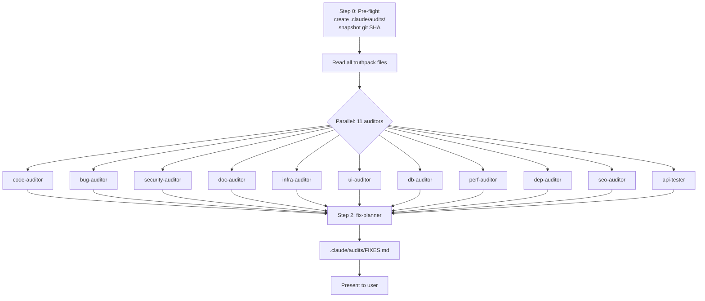

# Full Audit Plan — Seerfinale626

**Workflow:** `workflows/full-audit.md` (All 11 auditors in parallel → fix-planner)
**Project:** `Seerfinale626` — TypeScript / Express + React (Vite) monorepo (`client/`, `server/`, `shared/`)
**Truthpack source of truth:** `.vibecheck/truthpack/` (version 2.0.0, generated 2026-06-14)
**Output directory:** `.claude/audits/` (does NOT exist yet — must be created in step 0)

---

## 0. Pre-flight (one-time, sequential)

| # | Step | Owner | Output |
|---|------|-------|--------|
| 0.1 | Create `.claude/audits/` directory | orchestrator | empty dir |
| 0.2 | Snapshot current git ref (`git rev-parse HEAD`) into `AUDIT_META.md` | orchestrator | `AUDIT_META.md` |
| 0.3 | Read every truthpack file into working memory: `meta.json`, `routes.json`, `auth.json`, `security.json`, `database.json`, `dependencies.json`, `env.json`, `contracts.json`, `middleware.json`, `websockets.json`, `docker.json`, `graphql.json`, `history.json` | orchestrator | context only |

> **TRUTHPACK-FIRST RULE** — every auditor MUST read relevant truthpack files before scanning. If truthpack disagrees with code, the truthpack wins (and the discrepancy is itself a finding).

---

## 1. Parallel Audits (11 agents, simultaneous)

Each auditor is delegated via `new_task` in `code` mode. They run concurrently, write to their own file, and do not block each other.

| Agent | Domain | Truthpack files to read FIRST | Output file | Est. scope |
|---|---|---|---|---|
| `code-auditor` | Quality, complexity, maintainability | `routes.json`, `middleware.json` | `AUDIT_CODE.md` | `client/src/**`, `server/src/**`, `shared/src/**` |
| `bug-auditor` | Runtime bugs, logic errors, edge cases | `routes.json`, `contracts.json`, `database.json` | `AUDIT_BUGS.md` | all `.ts/.tsx` excluding `__tests__` |
| `security-auditor` | OWASP, injection, auth, secrets | `security.json`, `auth.json`, `env.json` | `AUDIT_SECURITY.md` | `server/src/middleware/`, `server/src/routes/`, `.env.example`, `server/src/services/stripe-service.ts`, `auth0-management.ts` |
| `doc-auditor` | Stale/missing docs, README drift | `meta.json`, all truthpack | `AUDIT_DOCS.md` | `README.md`, `docs/`, `client/CHANGES_SUMMARY.md`, `client/ENV_SECURITY_GUIDE.md`, JSDoc on public APIs |
| `infra-auditor` | Docker, CI/CD, config drift | `docker.json`, `history.json` | `AUDIT_INFRA.md` | `Dockerfile`, `.dockerignore`, `fly.toml`, `vercel.json`, `.gitlab-ci.yml`, `nx.json`, `drizzle.config.ts`, `server/drizzle.config.ts` |
| `ui-auditor` | A11y, UX, responsive, semantics | `meta.json` | `AUDIT_UI.md` | `client/src/components/`, `client/src/pages/`, `client/src/styles/` |
| `db-auditor` | N+1, indexes, schema, migrations | `database.json` | `AUDIT_DB.md` | `server/src/db/`, `shared/src/schema.ts` |
| `perf-auditor` | Bundle, render perf, memory leaks | `dependencies.json`, `routes.json` | `AUDIT_PERF.md` | `client/src/`, `client/vite.config.ts`, `server/src/services/websocket-service.ts` |
| `dep-auditor` | Vulnerable, outdated, unused deps | `dependencies.json` | `AUDIT_DEPS.md` | `package.json`, `client/package.json`, `server/package.json`, `shared/package.json`, lockfiles |
| `seo-auditor` | Meta, OG, structured data, sitemap | (none) | `AUDIT_SEO.md` | `client/index.html`, `client/src/pages/` (page-level `<Helmet>`/meta) |
| `api-tester` | Contract validation, endpoint smoke | `routes.json`, `contracts.json` | `AUDIT_API.md` | `server/src/routes/*.ts`, `shared/src/validators.ts` |

### Required output format (every audit file)

```yaml
---
agent: <name>
status: pass | warn | fail
findings: <int>
truthpack_version: 2.0.0
git_sha: <from step 0.2>
---
```

Followed by Markdown sections: **Summary**, **Findings** (each: `severity`, `location`, `description`, `remediation`), **Metrics**.

### Severity scale (used by all auditors)

| Level | Meaning |
|---|---|
| `critical` | Breaks prod, security hole, data loss |
| `high` | Significant bug, perf cliff, broken contract |
| `medium` | Maintainability, minor bug, a11y gap |
| `low` | Style, nit, future-proofing |
| `info` | Observation, no action required |

### Cross-auditor rules

- **De-dup at the boundary** — if `bug-auditor` and `security-auditor` both flag the same line, the lower number wins; the other references it.
- **No overlap** — `code-auditor` does NOT run security checks; `security-auditor` does NOT run style nitpicks.
- **Truthpack is the tiebreaker** — if an auditor's finding contradicts `routes.json` / `auth.json` / `database.json`, the finding is invalid and the truthpack gap is reported instead.

---

## 2. Fix Planner (sequential, AFTER all 11 audits complete)

| # | Step | Output |
|---|------|--------|
| 2.1 | Read all 11 `AUDIT_*.md` files in `.claude/audits/` | in-memory index |
| 2.2 | Build a unified finding table: `id, agent, severity, file, line, summary` | internal |
| 2.3 | De-duplicate by `(file, line, summary-hash)`; keep highest severity | internal |
| 2.4 | Group by domain (security, perf, db, ui, …) and by file | internal |
| 2.5 | Prioritize: `critical` → `high` → `medium` → `low` → `info` | internal |
| 2.6 | Estimate fix ordering (independent fixes first, then coupled ones) | internal |
| 2.7 | Emit `.claude/audits/FIXES.md` | `FIXES.md` |

### `FIXES.md` schema

```markdown
---
agent: fix-planner
status: pass | warn | fail
total_unique_findings: <int>
critical: <int>
high: <int>
medium: <int>
low: <int>
info: <int>
sources: [AUDIT_CODE, AUDIT_BUGS, ...]
---

## Executive Summary
<2-3 paragraphs>

## P0 — Critical (fix immediately)
- [F-001] **<title>** — `<file>:<line>` — <one-line fix>

## P1 — High (this sprint)
…

## P2 — Medium (next sprint)
…

## P3 — Low (backlog)
…

## Observations (info only)
…

## Suggested Fix Order
1. <epic A> (unblocks N other fixes)
2. <epic B>
…
```

---

## 3. Execution Sequencing (Mermaid)



---

## 4. Deliverables Checklist

- [ ] `.claude/audits/AUDIT_META.md` (git SHA, timestamp, truthpack version)
- [ ] `.claude/audits/AUDIT_CODE.md`
- [ ] `.claude/audits/AUDIT_BUGS.md`
- [ ] `.claude/audits/AUDIT_SECURITY.md`
- [ ] `.claude/audits/AUDIT_DOCS.md`
- [ ] `.claude/audits/AUDIT_INFRA.md`
- [ ] `.claude/audits/AUDIT_UI.md`
- [ ] `.claude/audits/AUDIT_DB.md`
- [ ] `.claude/audits/AUDIT_PERF.md`
- [ ] `.claude/audits/AUDIT_DEPS.md`
- [ ] `.claude/audits/AUDIT_SEO.md`
- [ ] `.claude/audits/AUDIT_API.md`
- [ ] `.claude/audits/FIXES.md`

---

## 5. Out of Scope (explicitly)

- **No code changes** — this is a *read-only* audit. Fixes are a separate workflow (`release-prep` or follow-up `code-fixer`).
- **No external network calls** — auditors use local truthpack + source only (no `npm audit` live network, no live API hits, no Lighthouse run).
- **No test execution** — `api-tester` performs *static contract review*; running live tests is `test-runner` (different agent).
- **No commits or PRs** — `pr-writer` is a separate agent.
